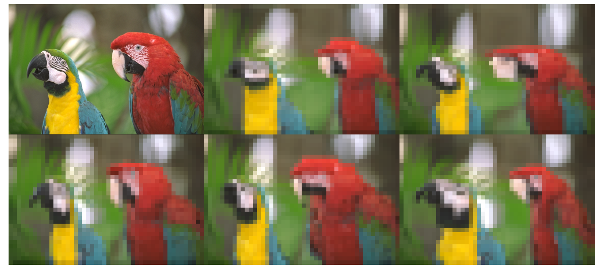

# fractional_max_pooling
This repository is implemented based on [Fractional Max-Pooling](https://arxiv.org/abs/1412.6071) which is written by Benjamin Graham in 2014. It is the top-1 model in [CIFAR-10 result list](http://rodrigob.github.io/are_we_there_yet/build/classification_datasets_results.html#43494641522d3130).
## Requirements
- Python3.6
- TensorFlow-gpu 1.13
- NumPy
- PIL

## Model Description

### MNIST
The input images are resized to (38, 38) which is slightly different with the size in that paper. The model is trained without dropout and data argumentation. The overall structure of the model can be expressed as follows: 
```
(32nC2 - FMP 2^{1/2})_6 - C2 - C1 - output.
```
Here is the comparison table on error rates.  

| The number of repeated tests 	| pseudorandom overlapping 	| random overlapping 	|
|---------------------------	|----------------------		|	--------------		|
| 1 test (mine)				   	|   0.53%                  	|	0.45%				|
| 12 test (mine)                |   0.34%                  	|	0.32%				|
| 1 test (paper)				|	0.44%					|	0.50%				|
| 12 test (paper)				|   0.34%					|	0.32%				|

#### Usage
- train: `python train_dev_test_FMP.py WEIGHT_DECAY_RATE GPU_DEVICE_NUM MODEL_NAME`
	- e.g. `python train_dev_test_FMP.py 0.8871 model.ckpt`
- test: `python testFMP.py ./PATH/TO/MODEL GPU_DEVICE_NUM`
	- e.g. `python testFMP.py ./model/model.ckpt 0`

#### Model Checkpoint
- pseudorandom overlapping
	- [meta](https://cloud.tsinghua.edu.cn/f/4773c8f9ca694b9dbdc4/?dl=1) 
	SHA256: e1593968648bb6665e2cede56b793945ef6369e89e8fe24bf1ab8bafb8d73c07
	- [index](https://cloud.tsinghua.edu.cn/f/781d47b47ee549d9831e/?dl=1) 
	SHA256: 14b991f3d0a4baedb8da761181130b48484eda9ec86d08683f9034141f1f8e5a
	- [data](https://cloud.tsinghua.edu.cn/f/fcc97c71d2c74c38b527/?dl=1) 
	SHA256: f71c969600dfac18b6a0c5af2702319dc97139b38e79a4c19046abf0b593157b
- random overlapping
	- [meta](https://cloud.tsinghua.edu.cn/f/df7e7aef99324e34ae2d/?dl=1) 
	SHA256: 483c51833be1078a172108ae8b743d1c888264ad18558f3f2fdd710e2e23c893
	- [index](https://cloud.tsinghua.edu.cn/f/b2d4eb813b43440fb358/?dl=1) 
	SHA256: 83bea54b67784e89064b7fb003e512a7ed9544b332ab2ce843c46651b01ad3cd
	- [data](https://cloud.tsinghua.edu.cn/f/a9724b756c164574aab3/?dl=1) 
	SHA256: 7677d1138e39191c6c7da8029e611b23f775e966ac4b07a6a582cbb10b5f5c17


### CIFAR100
The overall structure of the model can be represented as follows:
```
(128nC2 - FMP 2^{1/3})_6 - C2 - C1 - output
```
The number of layers is reduced since it is too time consuming to train the network described in the paper and its performance is not very good on the train set and validation set. The input images are resized to (46, 46). The model is trained without dropout and data argumentation.

| The number of repeated tests 	| pseudorandom overlapping 	| 
|---------------------------	|----------------------		|
| 1 test (mine)				   	|   48.08%                	|	
| 12 test (mine)                |   0.34%                  	|	

